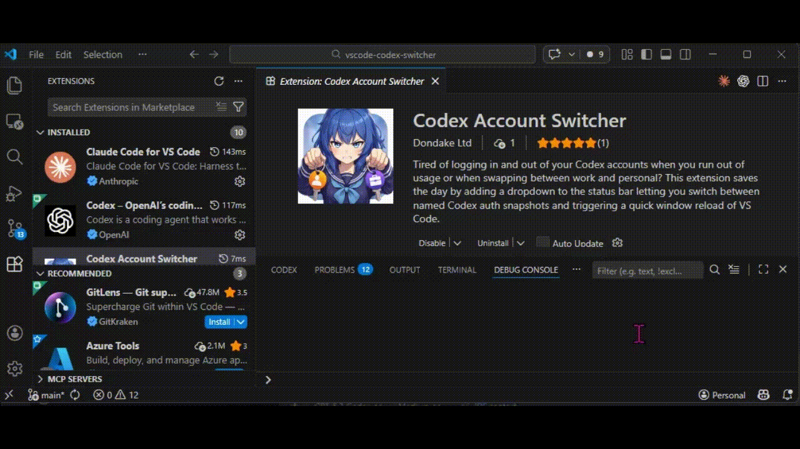

+----------------------+
| Codex Account Switch |
+----------------------+

# Codex Account Switcher

Humanity has suffered for too long.

Not war. Not famine. Not taxes.

The real ancient curse was this:

1. Click around trying to remember which Codex profile you are on.
2. Dive through menus and sub-menus just to see remaining usage.
3. Realize you are on the wrong account anyway.
4. Sigh like a Victorian orphan.

This extension fixes that.

You get fast Codex account/profile switching, visible usage, side-by-side usage comparisons, profile recovery tools, and less menu spelunking in general.

Civilization advances. Next stop: Mars.

## Demo



## What You Get

- A clean status bar switcher for jumping between Codex accounts/profiles.
- A separate usage monitor so you can see your remaining 5-hour and weekly allowance at a glance.
- A detailed usage view with charts, reset times, token usage, and profile comparison.
- Saved Codex profiles you can rename, delete, export, import, refresh, and reauthenticate.
- Recovery tools for the inevitable moment when a token decides it no longer believes in tomorrow.
- Support for local setups, WSL setups, and remote/SSH workflows.

## The Fun Part

Once it is set up, your flow becomes:

1. Click the status bar.
2. Pick the profile you want.
3. Keep working.

And when you want to check usage:

1. Glance at the usage item in the status bar.
2. Click it if you want the full fancy panel.
3. Compare profiles like the extremely serious professional you definitely are.

## Feature Set

### Fast Profile Switching

- Switch Codex accounts/profiles from a picker in the status bar.
- Keep multiple named profiles ready to go.
- Put the switcher on the left or right side of the status bar.
- Optional switch confirmation if you like guardrails.

### Usage Without Archaeology

- See last-known 5-hour and weekly usage right in the status bar.
- Choose whether percentages show **remaining** or **used**.
- Get a richer hover tooltip with reset timing and token usage.
- Open the full **Codex Usage** panel for comparison and history.
- If no fresh usage data exists yet, the extension shows a likely-unused estimate instead of acting like the universe has ended.

### Codex Usage Details Panel

- Large, readable side-by-side usage view.
- Compare your current profile against another saved profile.
- One-click **Switch Now** action from the compare panel.
- Daily, weekly, monthly, and yearly history ranges.
- Charts for per-profile usage history.
- Reset timing and token usage details without cluttering the status bar.

### Profile Management

- Import the current `auth.json` as a saved profile.
- Import an auth file manually.
- Log in with Codex CLI and save the result as a profile.
- Rename profiles.
- Delete profiles.
- Export/import profiles for backup or transfer.
- Reauthenticate a profile when tokens expire.
- Refresh a saved profile from the current auth without deleting and rebuilding it.

### Keeps Your Profile State Together

- Preserves the full saved auth payload per profile.
- Preserves Codex config state per profile too, so switching back feels like switching back.
- Handy when different profiles want different model or reasoning defaults.

## Quick Start

1. Install the extension.
2. Click the status bar switcher.
3. Choose one of these:
   - `Login via Codex CLI...`
   - `Import current auth.json`
   - `Import auth file...`
4. Give the profile a sensible name.
5. Switch like a person who values their time.

If you used the older snapshot-based version, it migrates those legacy accounts into the profile system automatically.

## Commands

- `codexAccountSwitcher.switchAccount`
- `codexAccountSwitcher.addAccount`
- `codexAccountSwitcher.deleteAccount`
- `codexAccountSwitcher.renameProfile`
- `codexAccountSwitcher.reauthenticateProfile`
- `codexAccountSwitcher.updateProfileFromCurrentAuth`
- `codexAccountSwitcher.manageProfiles`
- `codexAccountSwitcher.loginWithCodexCli`
- `codexAccountSwitcher.importProfiles`
- `codexAccountSwitcher.exportProfiles`
- `codexAccountSwitcher.editAccounts`
- `codexAccountSwitcher.exportActiveAuth`

## Settings

Everything lives under `codexAccountSwitcher.*`.

Most useful ones:

- `storageMode`: choose how saved profiles are stored.
- `statusBarSide`: put the switcher on the left or right.
- `confirmBeforeSwitch`: add a confirmation step before switching.
- `showUsageInStatusBar`: show/hide the usage monitor item.
- `showUsageInSwitcher`: show/hide usage inside the picker.
- `usagePercentDisplay`: choose `remaining` or `used` percentages.
- `usageColorsEnabled`: enable colored usage indicators.
- `usageRefreshIntervalSeconds`: control how often usage refreshes while VS Code is open.
- `reloadTarget`: choose extension-host restart or full window reload behavior.

Example:

```json
{
  "codexAccountSwitcher.storageMode": "auto",
  "codexAccountSwitcher.statusBarSide": "right",
  "codexAccountSwitcher.showUsageInStatusBar": true,
  "codexAccountSwitcher.showUsageInSwitcher": true,
  "codexAccountSwitcher.usagePercentDisplay": "remaining",
  "codexAccountSwitcher.usageColorsEnabled": true,
  "codexAccountSwitcher.usageRefreshIntervalSeconds": 30
}
```

## Security

Saved Codex auth is sensitive.

This extension is built to avoid splashing secrets around, but you still need basic operational sense.

- Treat exported profile files like passwords.
- Do not commit them.
- Do not casually share them.
- If a profile stops authenticating, use the reauthentication flow rather than deleting everything in a rage.

## Notes For Power Users

- Usage is based on local Codex session data, so it reflects what Codex has actually emitted on this machine/runtime.
- The active profile updates live as new usage data appears.
- Per-profile usage history is retained so the details panel can chart it over time.
- WSL and remote/SSH setups are supported.

## Development

- `npm run compile`
- `npm test`
- `npm run test:integration`
- `npm run package`

Manual release checklist is in `TESTING.md`.

This extension began as a way to stop wasting time on account switching and usage checking.
It has now evolved into a small monument to not putting up with nonsense.
